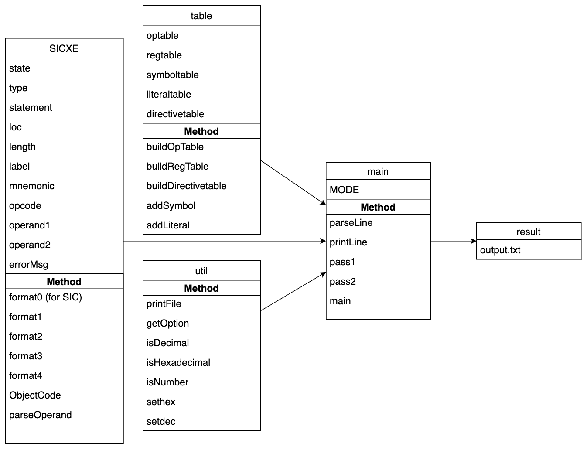
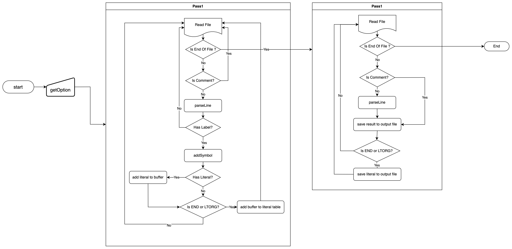

# SIC/SICXE Assembler Document

## Introduction

This is a SIC/SICXE assembler written in C++.

## Environment

- Development Platform: `macOS Ventura 13.2.1` `visual studio code`
- Development Language: `C++`
- Compiler: `Apple clang version 14.0.3 (clang-1403.0.22.14.1)`
- Build Tool: `make`

## Design

### Program Data Structure



### Program Flow



### Pass1

我嘗試將指令一行一行讀入。將每一行指令分成 `label` 、 `mnemonic` 、 `operand` 三個－部分拆開來。因為 pass1 的目標是要產生 symbol table 及 literal table，所以首要目標是知道每行指令的大小才能計算 location ，進而取得每個 symbol 的位置。首先參考公告提供的table 1~4及課本附錄創建了 opcode table 、register table 等結構，以紀錄每個 assembler 指令的 format 及參數等資訊，利用 opcode table 查詢指令的 format 就能知道大部分指令的大小。接著處理 directive (`BYTE` 、 `WORD` 、`RESB` 、`RESW`) 的部分，利用 operand 計算需保留的大小。在遇到 label 時便會立即加入 symbol table 中；而 literal 的部分則是會先加在 buffer 中，在遇到 `LTORG` 或 `END` 時才會計算 addresss 並加入 literal table 中。

### Pass2

pass2 的流程跟 pass1 有些接近，同樣將指令一行一行讀出來做處理。這部分的目標是要產生 object code，因此我定義了一個 SICXE 的 class，將每一行 source code 都打包成一個 SICXE 的型態，裡面會紀錄這行程式的所有資訊，如 location、mnemonic、operand、opcode等等，且包含一產生 object code 的方法。在處理每一行 source code 時，我會先判斷是否為指令，若是指令則會先將 mnemonic 轉成 opcode，再根據 format 來決定如何產生 object code。若是 directive 則會根據不同的 directive 來做不同的處理，如 `BYTE` 、 `WORD` 、`RESB` 、`RESW`、`BASE`、`NOBASE`、`LTORG`、`END`。

### Others

完成以上兩部分主程式後，我也有加一些錯誤判斷，如 label 重複報錯，以及新增 option 讓程式更人性化且有彈性。

## Not Implemented

1. 未加入四則運算的功能。

## Usage

### Compile

```bash
make clean && make
```

or you can compile by yourself:

```bash
cd src/lib/
g++ -c utils.cpp -o utils.o
g++ -c table.cpp -o table.o
g++ -c sicxe.cpp -o sicxe.o
cd ..
g++ main.cpp lib/utils.o lib/table.o lib/sicxe.o -o main
```

### Run

```bash
./main
```

The default input file is `src/input.asm` and the result will be in current folder.
You can also run with options, for example:

```bash
./main -i ./input.asm -o ./output.txt -m 1
```

### Options

- `-h` : show help
- `-i [input file]` : input file
- `-o [output file]` : output file
- `-mode [ mode ]` : mode (default: 1)
  - `0` : SIC
  - `1` : SICXE
